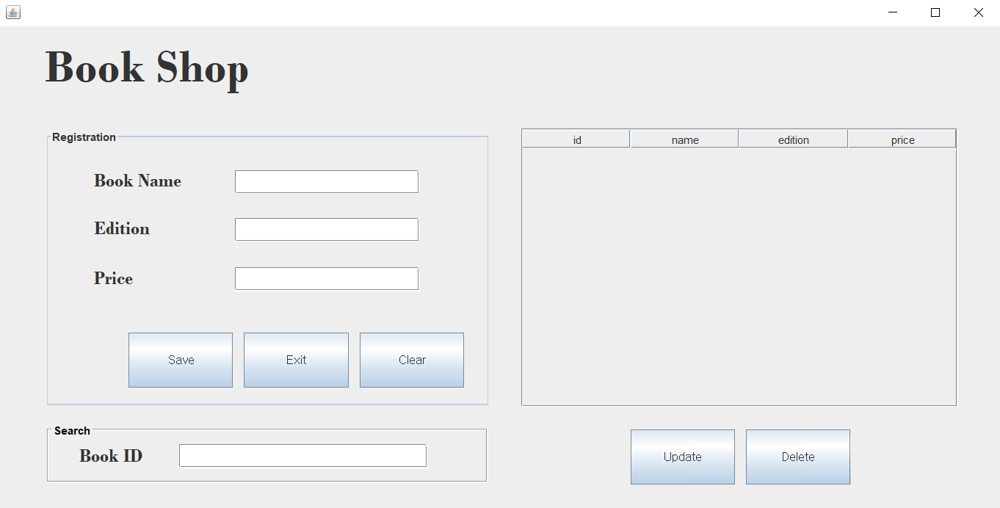
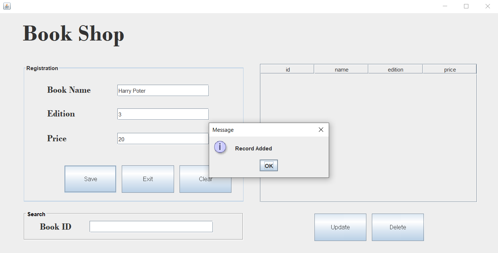
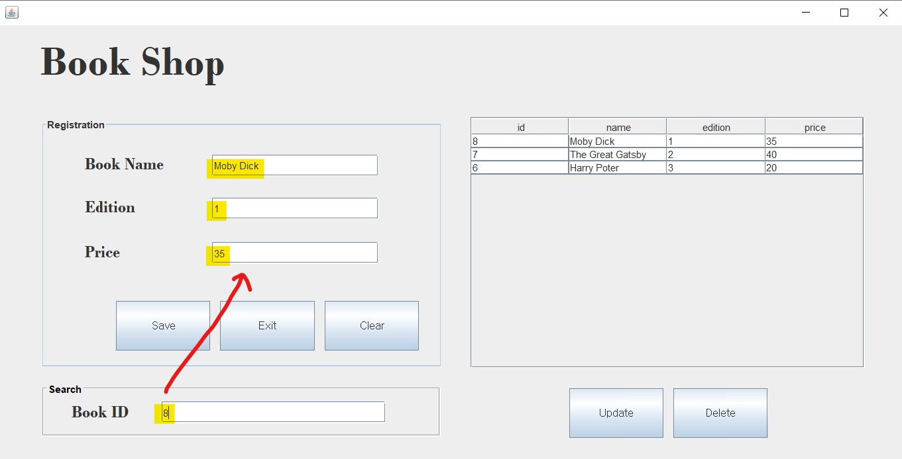
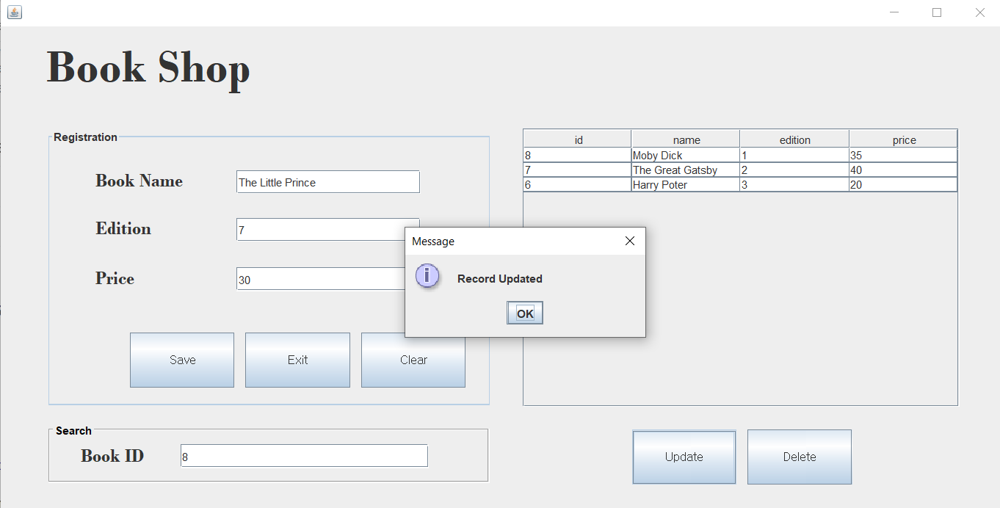
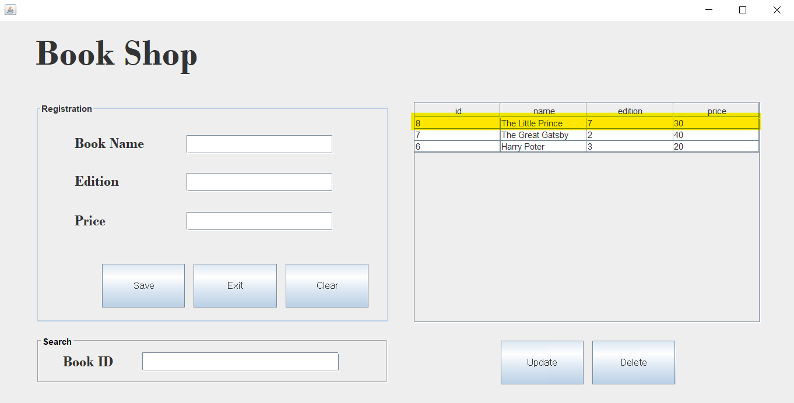
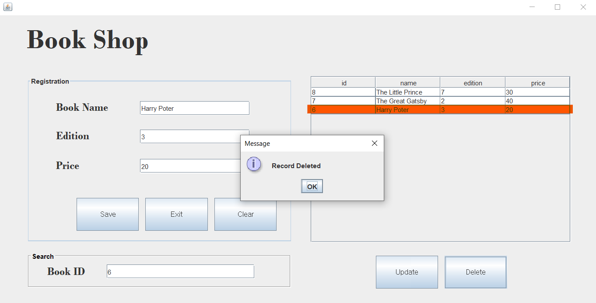
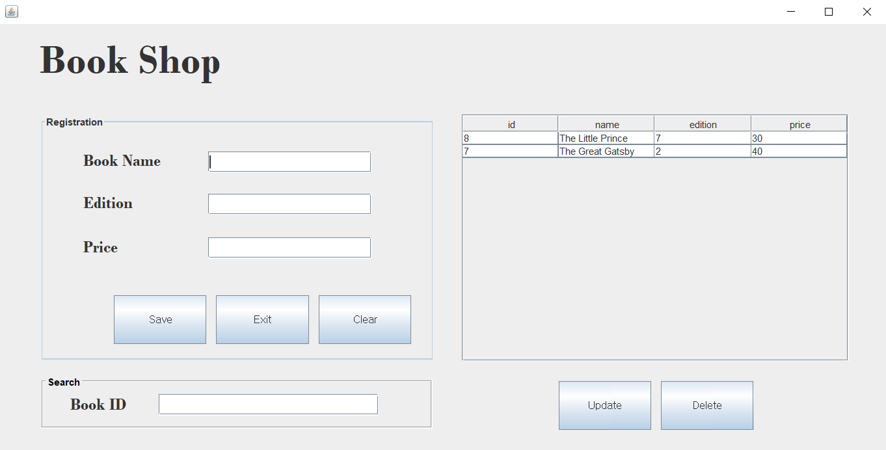

# Book Shop - CRUD management app of books

## Overview
Book store management application that has create/read/update/delete functionalities

## Technologies
- Java
- Java Swing(GUI Framework)
- MySQL

## Features
- **Adding book data**
  1. Fill in the text fields
  2. Press 'Save' button

- **Searching book data**
  1. Enter the Book ID in the search box (Book ID is auto-created when you add a book data)
  2. Then the book information is automatically field

- **Updating book data**
  1. Enter the Book ID in the search box
  2. Then the book information is automatically field
  3. Now the user can change the inputs
  4. Press 'Update' button

- **Deleting book data**
  1. Enter the Book ID in the search box
  2. Then the book information is automatically field
  3. Press 'Delete' button

- **Clearing text fields**
  - With 'Clear' button, the user can clear the entered inputs in the text fields.

- **Exit**
  - With 'Exit' button, the user can execute the program
